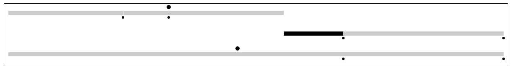

# Timeline
Visualization made using D3 hierarchy. Each node can be a `bar`, `event` or `checkpoint` type.



## Installation
```sh
$ yarn
$ yarn dev
```

## Example
```javascript
import timeline from './timeline'

const data = {
    // Root node, a wrapping bar
    id: 1,
    type: 'bar', // Node type
    start: 1485392400,
    end: 1485435600,
    children: [{
        // Child node
        id: 1,
        type: 'event',
        time: 1485402400,
        children: []
    }]
}

const timelineChart = timeline()
  .margin({ top: 0, bottom: 0, left: 10, right: 10 })
  .width(1200)
  .height(150)
  .domain([1485392400, 1485435600])

d3.select('.chart')
  .datum(data)
  .call(timelineChart)
```

### Prod bundle
```sh
$ yarn run build
```

## TODO

* xAxis
* Highlight classes (branch, children, parents) on hover

* Add tests
* Icons inside nodes (checkpoints and events)

* Tooltips
* Brush tool
